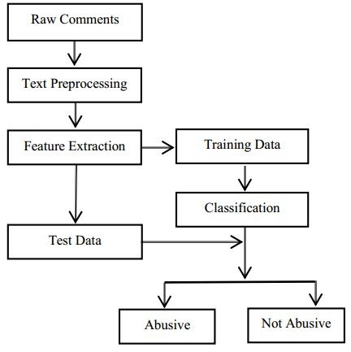

# TOXIC-COMMENT-CLASSIFICATION

DATA DESCRIPTION :

The primary data for the competition is, in each provided file, the comment_text column. This contains the text of a comment which has been classified as toxic or non-toxic (0...1 in the toxic column). The train set’s comments are entirely in english and come either from Civil Comments or Wikipedia talk page edits. The test data's comment_text columns are composed of multiple non-English languages.

Dataset have 223549 rows and  8 columns

columns are:

1. id - dentifier within each file.

2. comment_text - the text of the comment to be classified.

3. toxic : whether or not the comment is classified as toxic

4. severe_toxic

5. obscene

6. threat

7. insult

8. identity_hate

Flowchart :

Challenges :

1. Preprocessing

2. Word2vac VS tf-Idf

3. Using best ML algorithm

Steps :

1. APPLY EDA
2. Preprocessing
 -  Removing html tags 
 -  Removing Punctuations
 -  Performing stemming
 -  Removing Stopwords

3. Apply TF-IDF nlp algo to covert words to vectors
4. Apply desion tree to multilabel classification

